> 译自：[Improve your iOS team’s productivity by building features as frameworks](<https://medium.com/flawless-app-stories/improve-your-ios-teams-productivity-by-building-features-as-frameworks-9d2a64cbcab5>) (需要翻墙)
>
> 注：其实不仅仅适用于Swift项目，对所有项目都有参考意义。
>
> 全文约1000字，阅读耗时：约7min。

> Adding features to a large, existing codebase is a challenge that many engineers will face in their coding career. If an iOS app has been around for more than a few years, it’s likely to have had many developers contributing on many features that made it into many releases. Often, the result can be a very large codebase with varying degrees of modularization, long build times, and not very clean code.

向已存在的大型项目添加新功能，是一件很常见的事情。如果一个App已面市多年，那么这个App项目就会有很多不同的工程师写了许多功能，发布不少release。通常就会造成一个很大的代码库，有不同程度的模块化、超长的编译时间，还有不是很干净的代码。

> The iOS app at Scout24 was in such a state not long ago, and I’d like to share with you how we made significant improvements to our development environment and what the benefits were.

不久之前，我的这款App(原作者自己的App)就处于这样的状况。现在，我想与您分享一下，我们对开发环境做了哪些重大改进，和它们带来的好处。

#### 问题

> If you’ve been developing with Swift in a large project, you are probably too familiar with the amount of time it takes to build the entire app module, even after a small change. There are [tons](https://github.com/fastred/Optimizing-Swift-Build-Times) of [resources](https://medium.com/@joshgare/8-tips-to-speed-up-your-swift-build-and-compile-times-in-xcode-73081e1d84ba) on [how to improve](https://developer.apple.com/videos/play/wwdc2018/408/) the overall duration.

如果你正在使用Swift开发大型项目，那么花费大量时间去构建一个完整的App简直就是家常便饭，即使是一个小小的改动。这儿有一些资源，对减少编译时间也许有帮助。(链接请见原文)

> Swift has a lot of great language features, but those features come at the cost of longer compile times. Even after making a small change, you could be waiting for up to a few minutes before you can see the results. This is really distracting and very inefficient! Time and concentration are your most precious resources while coding.

虽然Swift有许多语言特性，但这提升了编译耗时。即使是改动一小块，在你得到编译产物之前也得耗费不少时间。这真的烦，真的没效率！(译者注：此时不应该刷一刷zhihu？)时间和专注是敲码时最珍贵的东西。

#### 如何解决

> The answer to the long build times is simple: **make the compiler build less code!** Sounds reasonable, but how can we achieve this? The answer is by using iOS frameworks to compartmentalize our code into smaller, more discrete chunks of functionality.

答案很简单：让编译的代码变少！

听起来很合理，但怎么做呢？那就是使用iOS frameworks划分我们的代码，分离功能性代码。使得参加编译的代码变少，编译时间也就减少了。

> In this example, we will start with the main app module and add a framework that contains some UI functionality that makes up a feature which we will integrate into our app.

在本教程中，我们会新建一个项目（main app module + other modules），增添一些UI相关的framework作为一个个的feature，然后使用这些framework联合主模块编译成一个app。

译者注：本教程中，我们需要区分一下，<u>新建的项目分为主模块和其它模块。主模块是可以直接编译为app的，它依赖于其它模块</u>。

#### 这样做的优点

> It may not seem obvious with such a small example, but the advantages of developing in this way are huge. They are especially big when you have to build functionality into a large app that has a lot of legacy components.

在本教程中(小项目)看来不是很明显，但这样的开发的优势是巨大的，尤其是你必须在有大量遗留组件的应用程序中。

> By building features as separate modules that are highly independent of the main app module, you can focus more on the features you want to create. You will notice being forced to organize your code in a way that exposes only what is necessary to the app module, the code tends to be much cleaner and well thought out, and it’s less likely to develop into a spaghetti mess because it’s more difficult to do so.

使用与主模块高度独立的模块编译，会让你集中注意在编写新的feature上。只暴露必需的模块给主模块，代码往往会更清晰和干净，不会一团乱麻。

> An essential step in building features as frameworks is to create a “wrapper app”, much like we will do in this tutorial, that minimally integrates the functionality you’ve created into a tiny app. This app won’t have to build all the other dependencies necessary for your main app module, so your build times will be lightning fast.

创建一个**wrapper app**是构建feature作为framework的一个重要步骤，就像本教程中所做的那样，将你创建的功能最小化地集成到一个轻量app中。这个app不必构建主模块所需的所有其它项，因此编译会非常快。

#### 教程开始：创建一个app workspace

> You will need to create a workspace for your app and the framework where your feature will live. Start by clicking *File -> New -> Workspace* in Xcode. Create a new folder where you want to save the workspace.

本教程使用了Workspace构建应用，估计和一般新建App方式不太一样，按照图例来就行了。打开Xcode，点击*File -> New -> Workspace*。

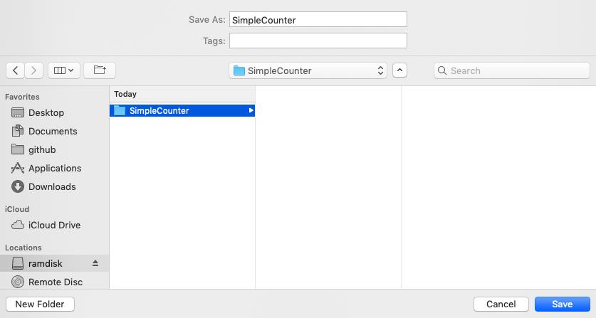

然后新建项目，*File -> New -> Project*。

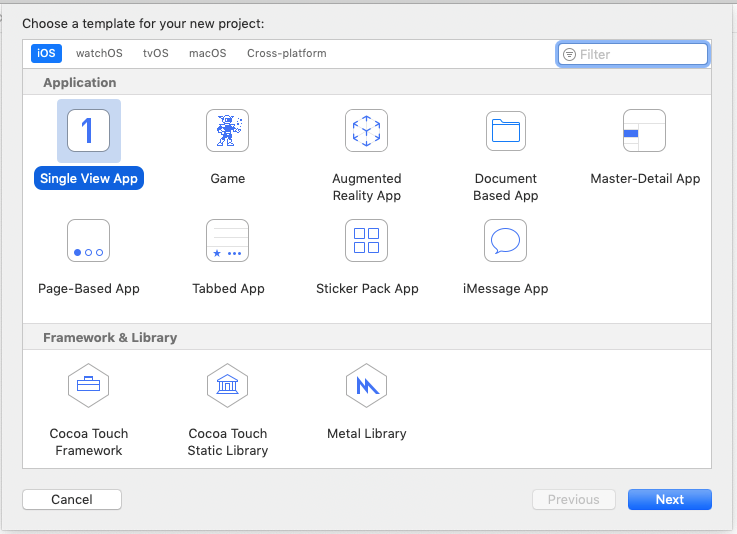

简单配置一下，

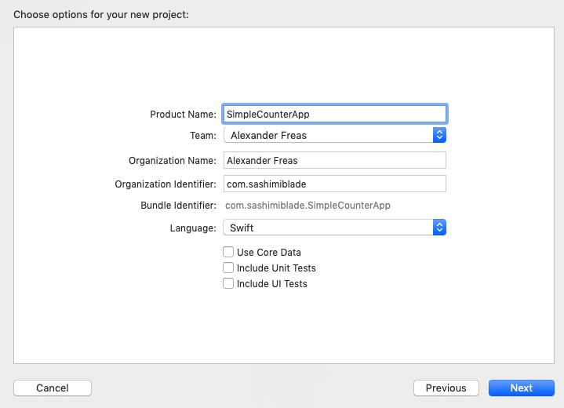

然后保存在刚刚新建的workspace目录下，

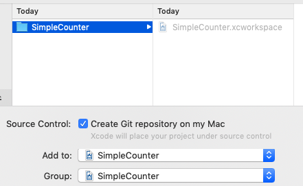

至此就新建完毕了

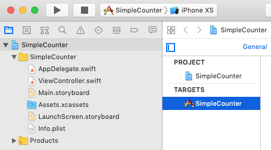

接下来添加framework！点击*File -> New -> Project*，选择“Cocoa Touch Framework”模板。

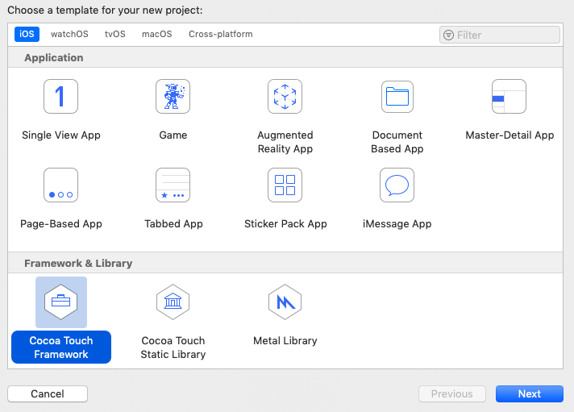

framework取名为*SimpleCounterFeature* (你也可以取其它名字)，然后下一步，到保存界面，在.xcworkspace文件目录下，在界面*Add to*选择*SimpleCounter* workspace(注意图标不一样，这里不是文字)，*Group*栏选择workspace根目录。

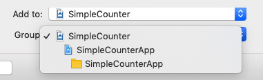

现在已经把framework添加到workspace中了，你的项目结构应该像这样：

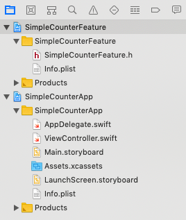

在scheme列表里，应该有2个schemes，一个是framework，一个是app。

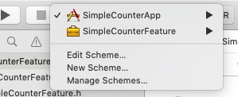

往*SimpleCounterFeature*里添加新的controller类，

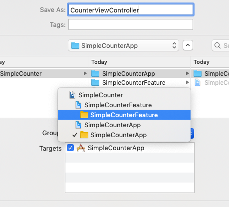

添加完后，试着编译一下，看有没有错，一般来说没啥大的问题。

#### 暴露功能接口

> When writing code that you want to expose to the app module from your framework, it’s important to keep in mind what access level you give your interfaces. We don’t really concern ourselves normally with *public*, *open* or *internal* access levels when writing Swift code for an app module. That’s because all the code lives in the same module, making the distinction less important. In a module, *internal* is the default access level for member properties and methods, meaning they are available across the module by default.
>
> When developing frameworks, it’s different. Because the code you write will be packaged into a separate binary to be used by a module outside its scope, access levels are more relevant.
>
> If you want to expose anything to the outside, whether it’s a struct, protocol, class, or any property or method, you need to specify a *public* access level. If you don’t, the entity will not be visible to the module that imports it. The [Swift docs have a great explanation](https://docs.swift.org/swift-book/LanguageGuide/AccessControl.html) about access control that you may read a bit differently having completed this tutorial.
>
> For example, in our *CounterViewController* class, we need to expose the class to be *public* if we want to be able to use it outside the framework module:
>
> The member IBOutlet properties will not be visible outside the module since they are marked as *internal.*
>
> I won’t go into detail about how to wire up the nib to the view controller, or how to add the rest of the counter functionality, as there’s nothing special here. If you’re interested, you can check out the sample project to see how it’s done. In interface builder, I just created a button and a label and hooked them up to the IBOutlets and added some simple functionality.

从framework暴露接口给app module，有一件事情很重要，即**接口权限**。Swift的代码默认权限是internal，要想暴露接口，请使用*public*或者*open*。只想提供接口，请使用public；不仅提供接口，还提供继承功能，请使用open。这其实是Swift的基础知识，这里不多讲啦。

本教程中，我们赋予了*CounterViewController*类public权限。你可以在*CounterViewController*中随意写点什么，不知道写啥，可以看后面我提供的Demo地址。

(译者注：这里我翻译的很简单，详细请见原文)

#### 添加Framework

在项目Setting的General中找到*Embedded Binaries*，添加我们刚刚建的*SimpleCounterFeature.framework*。

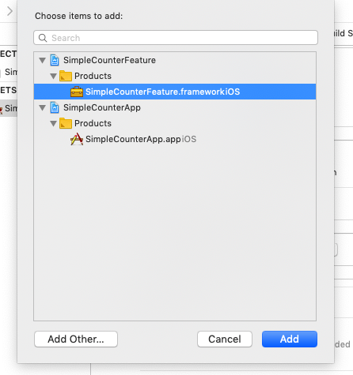

> This adds the framework to the *Embedded Binaries* for the app module and links it. Adding the framework to the *Embedded Binaries* is needed because your *SimpleCounterFeature* framework isn’t available to iOS like UIKit is, meaning it needs to be copied into the app bundle during build time.
>
> Now build the SimpleCounterApp scheme. If it built successfully, you are ready to start integrating your framework!

这样在编译的时候，就会自动链接我们添加的framework。在*Embedded Binaries*中添加是必须的，因为这个framework不像UIKit是系统自带的，意味着在编译期，我们需要拷贝一份进app bundle里。

现在试着编译*SimpleCounterApp*。如果编译成功，那么你已经做好准备集成你的framework了！

#### 集成framework

> Before we integrate the view controller into your app module, we need to do some cleanup first. Start by deleting the *Main.storyboard* file and deleting the *Main Interface* entry in the *General* tab of the app module’s project page.

在集成CounterViewController这个新的controller之前，我们需要做一些清理工作。删除*Main.storyboard*，在项目配置页的General栏删除*Main Interface*。

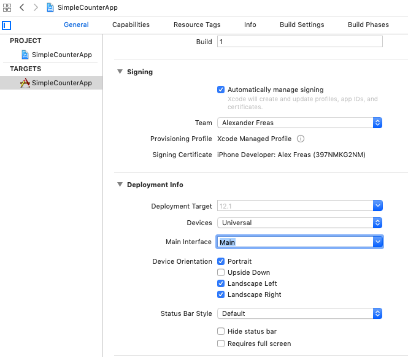

> You can also delete the *ViewController.swift* file in the main app module, too. You won’t be using this.
>
> In the *AppDelegate.swift* file, import the SimpleCounterFeature framework and create a UIWindow with the root view controller as the *CounterViewController.*

删除ViewController.swift文件，它没用了。

在*AppDelegate.swift*文件中，创建一个UIWindow，并用*CounterViewController*对象作为它的根视图(root view controller)。

现在编译，若没有错误就能运行了！

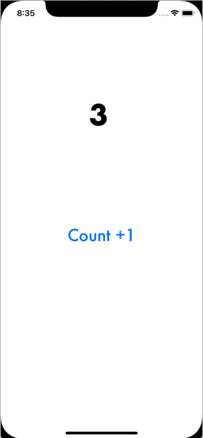

#### 资源

- Example code: <https://github.com/akfreas/SimpleCounter>
- Apple Docs on Access Control: <https://docs.swift.org/swift-book/LanguageGuide/AccessControl.html>

#### 译者言

本文给出了一种模块化项目的方法，通过将项目划分为不同模块作为framework，建立壳（wrapper）项目来集成所有framework来减少编译耗时。

但这样也带来两个问题：

1. 如何确定模块边界？模块划分的粒度是怎样的？这对项目负责人有很高的要求。
2. 多framework带来App启动耗时增加。若模块较多，会导致App在启动的时候会依次加载所有framework。

这些问题需要项目负责人权衡。

